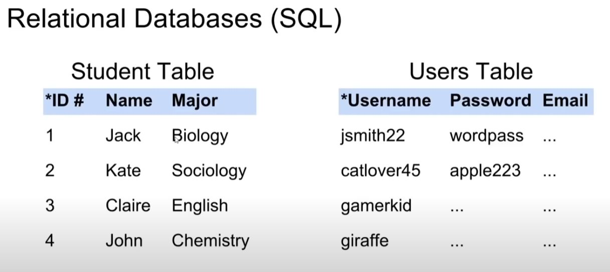
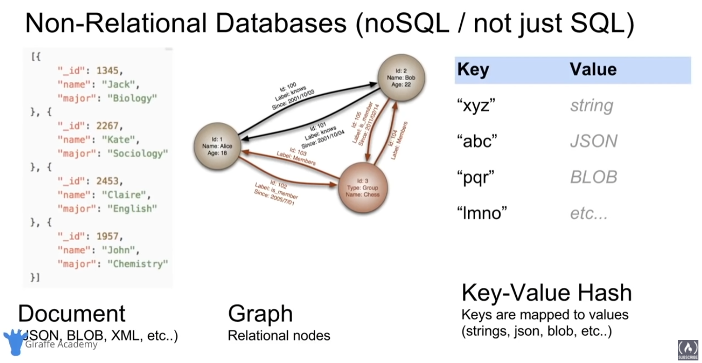

# SQL-Database-Course
My progress from following freecodecamp.org - Precursor for ASP.NET crash course

From https://www.youtube.com/watch?v=HXV3zeQKqGY

- Relational Database Management System -> Software we can use to manage a database
- MySQL to write SQL code & queries to create databases, tables, input information, retrieve information
- Design database schemas -> Consists of all the different tables & relations that will be stored

~ What is a database (DB)?
  - Any collection of related information that can be stored in different ways
~ Database Management System (DBMS)
  - A special software program used to help users create and maintain a DB
    - Allows management of large amounts of information
    - Security
    - Backups
    - Importing/Exporting data
    - Concurrency
    - Interacts with Software Applications
      - Programming Lanaguages

~ C.R.U.D --> Create, Read, Update, Delete
  - these are the four main operations working with databases

~ 2 Types of Databases
  1.) Relational Databases (SQL)
    - Each tables has columns & rows
    - A unique key identifies each row
  2.) Non-Relational (noSQL / not just SQL)
    - Key-value stores
    - Documents (JSON, XML, etc.)
    - Graphs
    - Flexible Tables
    

--Notice on the LHS table, the ID# is unique for every row entry, RHS table utilizes unique usernames for each entry.

~ For Relational Databases --- Structured Query Language (SQL)
  - Utilize Relational Database Management Systems (RDBMS)
  - Help users create & maintain a relational database
    - mySQL, Oracle, postgreSQL, mariaDB, etc.
  - Structured Query Lanaguage (SQL)
    - Standardized language for interacting with RDBMS
    - Used to perform C.R.U.D operations, as well as other administrative tasks (user management, security, backup, etc.)
    - Used to define tables & structures
    - SQL code used on one RDBMS is not always portable to another without modification.

~ Just like Relational DB's, we can have non-relational DB systems 
  - Non-Relational Database Management Systems (NRDBMS)
    - Help users create & maintain a non-relational database
      - mongoDB, dynamoDB, apache cassandra, firebase, etc.
  - Implementation Specific
    - Any non-relational database falls under this category, so there's no set language standard
    - Most NRDBMS will implement their own language for performing C.R.U.D and administrative operations on the database

~ Database Queries
  - Queries are requests made to the dbms for specific information
  - As the database's structure become more complex, it becomes difficult to get the specific pieces of information we want.
    - Ex: A google search is a query

  
