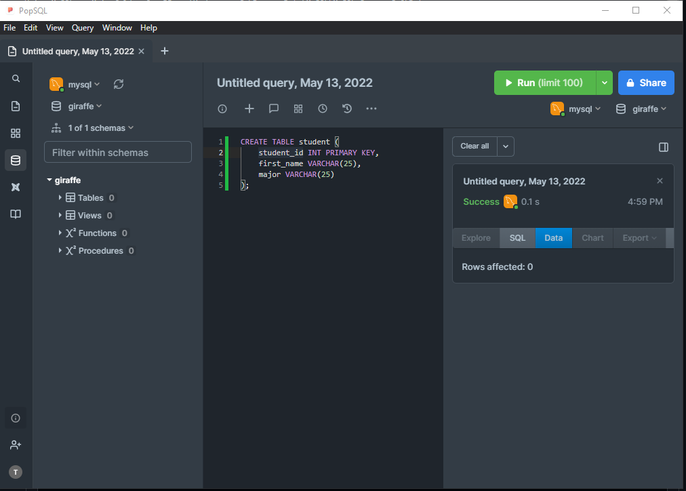

~ Using MySQL -> Main folder for DB on Windows -> C:\ProgramData\MySQL\MySQL Server 8.0\Data

~ Utilizing PopSQL (SQL editor) which can use local db connections from what was created using MySQL

--------------------------------------- COMMANDS ---------------------------------------

~ It's a convention to write SQL commands/code in all capital letters typically to differentiate between other code & line ends with semicolon
  - I.e., 
    
    CREATE TABLE student
    (
    
      student_id INT PRIMARY KEY,
      name VARCHAR(25),
      major VARCHAR(20)
      
    );
    
~ From PopSQL running the 'giraffe' database created in MySQL:

    
~ Using Command Line Client:
  - Displaying all databases detected:
    - SHOW DATABASES;
  - Creating a database:
    - CREATE DATABASE <db name>;
  - Deleting a database:
    - DROP DATABASE <db name>;
  
~ In editor:
  - CREATE TABLE
  
--------------------------------------- DATA TYPES ---------------------------------------

~ For the DECIMAL(M,N) -> both M and N are numbers where M is the total number of digits that you want to store and N is the number of digits you want to store after the decimal point. 
  - For example: DECIMAL(10,4) means a total of 10 total digits and 4 of those digits are after the decimal place. 
  - VARCHAR is (variable char or variable character) is a way to store a string of a particular length
    - I.e., VARCHAR(10) means a string of length 10
  - BLOB is for 'Binary Large Object' which acts as a structure for storing large data such as images, files, etc.
