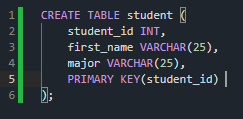

~ Using MySQL -> Main folder for DB on Windows -> C:\ProgramData\MySQL\MySQL Server 8.0\Data

~ Utilizing PopSQL (SQL editor) which can use local db connections from what was created using MySQL

--------------------------------------- COMMANDS ---------------------------------------

~ It's a convention to write SQL commands/code in all capital letters typically to differentiate between other code & line ends with semicolon
  - I.e., 
    
    CREATE TABLE student
    (
    
      student_id INT PRIMARY KEY,
      name VARCHAR(25),
      major VARCHAR(20)
      
    );
    
    ~ We can also use constraints for particular variables to be NOT NULL or UNIQUE:
    
    CREATE TABLE student
    (
    
      student_id INT,
      name VARCHAR(25) NOT NULL,
      major VARCHAR(20) UNIQUE,
      PRIMARY KEY(student_id)
    );
    
    ~ Additionally, we could set default values for particular variables:
    
    CREATE TABLE student
    (
    
      student_id INT,
      name VARCHAR(25),
      major VARCHAR(20) DEFAULT 'undecided',
      PRIMARY KEY(student_id)
    );
    
~ From PopSQL running the 'giraffe' database created in MySQL:

~ Note: You can also specify a primary key in this way as well:

    
~ Using Command Line Client:
  - Displaying all databases detected:
    - SHOW DATABASES;
  - Creating a database:
    - CREATE DATABASE {db name};
  - Deleting a database:
    - DROP DATABASE {db name};
  
~ In editor - Defining a basic schema:
  - CREATE TABLE {table name} (); -> creates a table 
  - DESCRIBE {table name}; -> run query to view the table contents
  - DROP TABLE {table name}; -> deletes the table
  - ALTER TABLE student ADD gpa DECIMAL(3, 2); -> This will add a decimal type variable called gpa to the student table
  - ALTER Table student DROP COLUMN gpa; -> This will drop the gpa attribute (column) in the student table
  - SELECT * FROM student; -> This will show/highlight the information within the student table
  
  * Note: Performing these commands in the editor is essentially defining the SCHEMA of the database.
    - Meaning you would create all these tables/attributes first and THEN input your data after.
    
~ Inserting data into tables:
  - INSERT INTO student VALUES(1, 'Jack', 'Biology'); -> this will insert a single row into the student table (student_id = 1, first_name = 'Jack', major = 'Biology')
    - You can change the insert data then run the program again and it will enter a new row (new student) and show the changes when you use the SELECT * FROM student; command 
  - Let's say you don't know what major a particular student has, you are able to specify the only information you know in the input data:
    - For example: INSERT INTO student(student_id, name) VALUES(2, 'Kate'); -> this will automatically enter NULL for the major column for this student
  - Note: You would not be able to enter another student with a primary key that already exists in the student table! (hence why the primary keys are unique)
  
--------------------------------------- DATA TYPES ---------------------------------------

~ For the DECIMAL(M,N) -> both M and N are numbers where M is the total number of digits that you want to store and N is the number of digits you want to store after the decimal point. 
  - For example: DECIMAL(10,4) means a total of 10 total digits and 4 of those digits are after the decimal place. 
  - VARCHAR is (variable char or variable character) is a way to store a string of a particular length
    - I.e., VARCHAR(10) means a string of length 10
  - BLOB is for 'Binary Large Object' which acts as a structure for storing large data such as images, files, etc.
