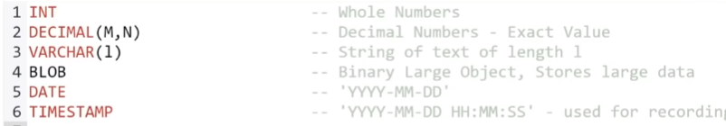

~ Using MySQL -> Main folder for DB on Windows -> C:\ProgramData\MySQL\MySQL Server 8.0\Data

~ Utilizing PopSQL (SQL editor) which can use local db connections from what was created using MySQL

--------------------------------------- COMMANDS ---------------------------------------
~ Using Command Line Client:
  - Displaying all databases detected:
    - SHOW DATABASES;
  - Creating a database:
    - CREATE DATABASE <db name>;
  - Deleting a database:
    - DROP DATABASE <db name>;
  
--------------------------------------- DATA TYPES ---------------------------------------

~ For the DECIMAL(M,N) -> both M and N are numbers where M is the total number of digits that you want to store and N is the number of digits you want to store after the decimal point. 
