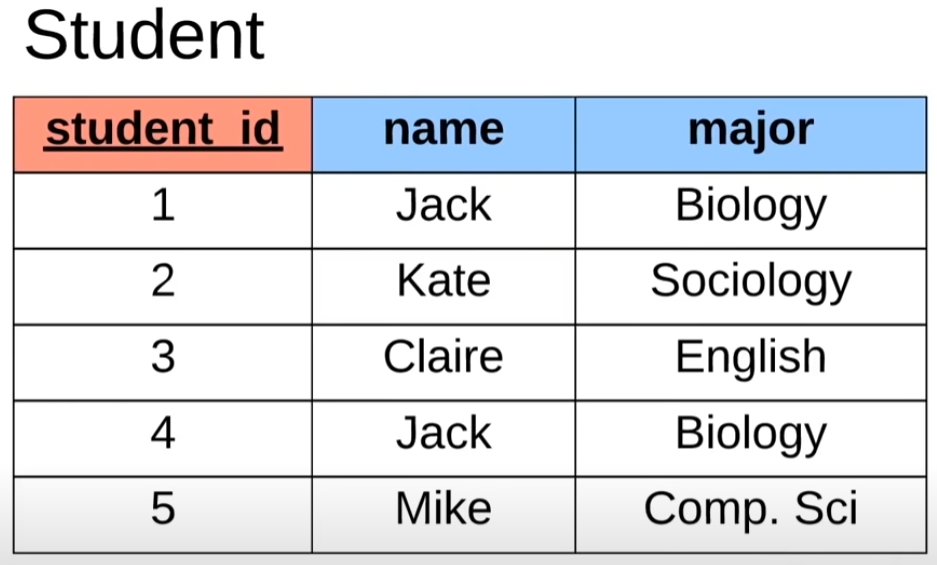

From this example, we can see this is called the 'Student' table, which defines specific information about student data

This consists of:
  - columns (vertical): student_id, name, major 
  - rows (horizontal): which entail the data entries (each entry encapsulates data of a single student)

~ Notice the student_id column is underlined -> indicates a PRIMARY KEY
  - Primary key columns are typically the very first column for a table
  - What is a primary key?
    - An attribute which UNIQUELY defines the row in the database (meaning each row entry for the primary key column is unique)
~ Also notice that for student_id 2 and 4, the name Jack and associated major Biology columns have the same entries
  - And so, these primary keys are used to differentiate both Jacks who major in biology!
  - (More table examples after 27:25 in the video)
~ Surrogate Keys - Random key assignment as primary key (no key mapping to real world), but is more used to uniquely identify 
~ Natural Keys - Numbers that also uniquely identify rows as primary key, although may have more meaning involved (i.e., social security number)

~ Foreign Keys - Attribute we can store to a DB table which essentially links us to another DB table
  - Stores the primary keys of the Row entries of the linked DB table

