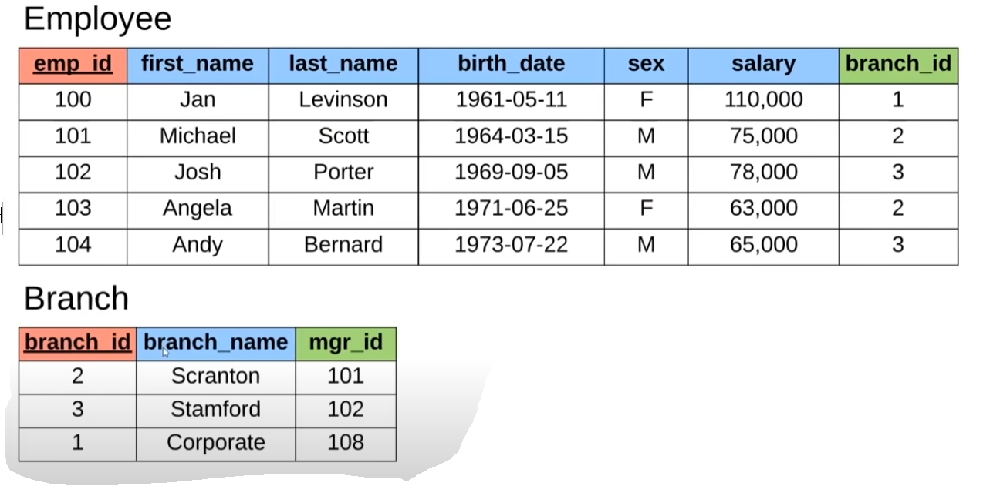
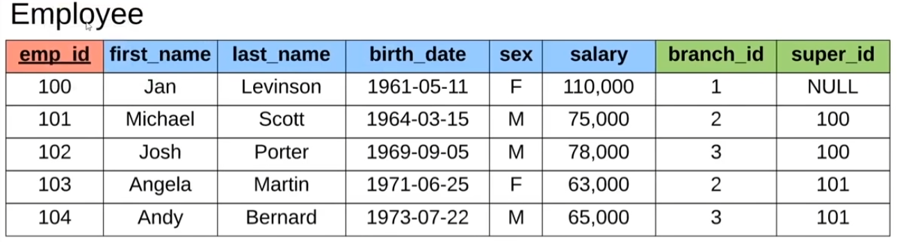
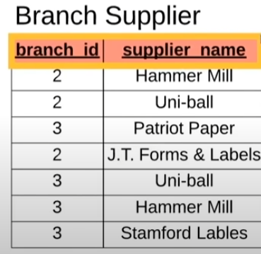

From this example, we can see this is called the 'Student' table, which defines specific information about student data

This consists of:
  - columns (vertical): student_id, name, major 
  - rows (horizontal): which entail the data entries (each entry encapsulates data of a single student)

~ Notice the student_id column is underlined -> indicates a PRIMARY KEY
  - Primary key columns are typically the very first column for a table
  - What is a primary key?
    - An attribute which UNIQUELY defines the row in the database (meaning each row entry for the primary key column is unique)
~ Also notice that for student_id 2 and 4, the name Jack and associated major Biology columns have the same entries
  - And so, these primary keys are used to differentiate both Jacks who major in biology!
  - (More table examples after 27:25 in the video)
~ Surrogate Keys - Random key assignment as primary key (no key mapping to real world), but is more used to uniquely identify 
~ Natural Keys - Numbers that also uniquely identify rows as primary key, although may have more meaning involved (i.e., social security number)

~ Foreign Keys - Attribute we can store to a DB table which essentially links us to another DB table
  - Stores the primary keys of the Row entries of the linked DB table

~ As we can see here, the Employee table uses the branch_id foreign key to associate the Branch table primary key entries!
  - Notice these foreign keys can be used multiple times given the different entries
    - I.e., Jan is associated with foreign branch_id 1, which means she is a part of the Corporate branch
  - Notice the branch table can also link its own foreign keys as well back to the Employee table
    - So mgr_id in the branch table links to the Employee primary key (emp_id) which is associated with manager id of the Employee
  - So essentially, these foreign keys help us define the relationships between entries in different tables!

~ Foreign keys are not limited to only a single foreign key column--meaning tables may have multiple foreign key associations

Example:

- So, we can see there is an additional super_id foreign key column which represents the supervisor ID of an employee
  - Basically, this super_id is actually linking foreign key to its OWN EMPLOYEE TABLE!
    - So Angela (emp_id 103) has super_id 101 -- indicating her supervisor has emp_id 101 who is Michael Scott 

~ Composite Key
  - When a table doesn't have a primary key to uniquely define each entry, then it may need to use composite keys...
  - This is where 2 or more attributes (columns) are used instead of 1 to uniquely identify every row...
  - Ex: branch_id and supplier_name are two columns where each individual row may have duplicates, but every branch_id & supplier_name pair ARE UNIQUE. So the tuples/pairs of the compositie key columns are in fact unique
  
Example:

